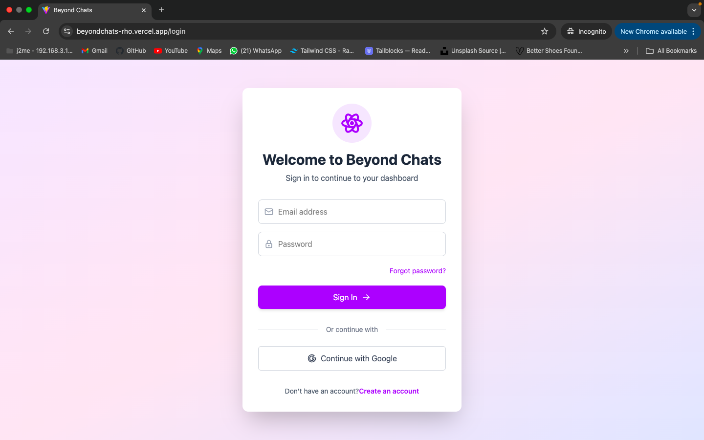
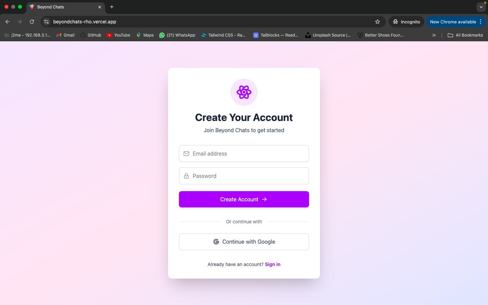
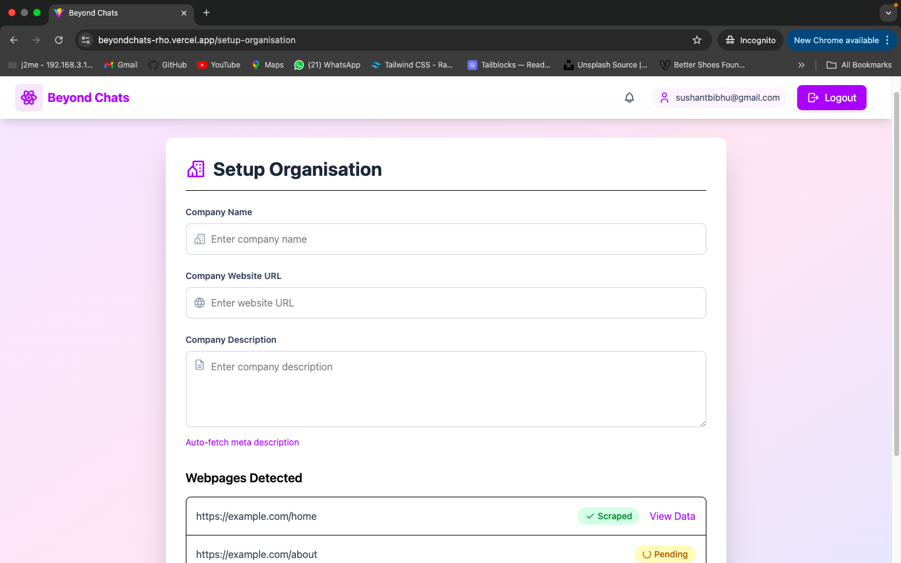
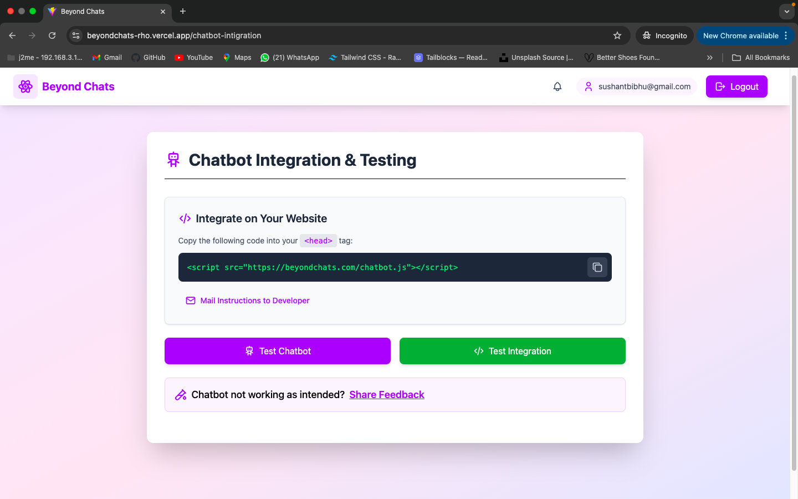
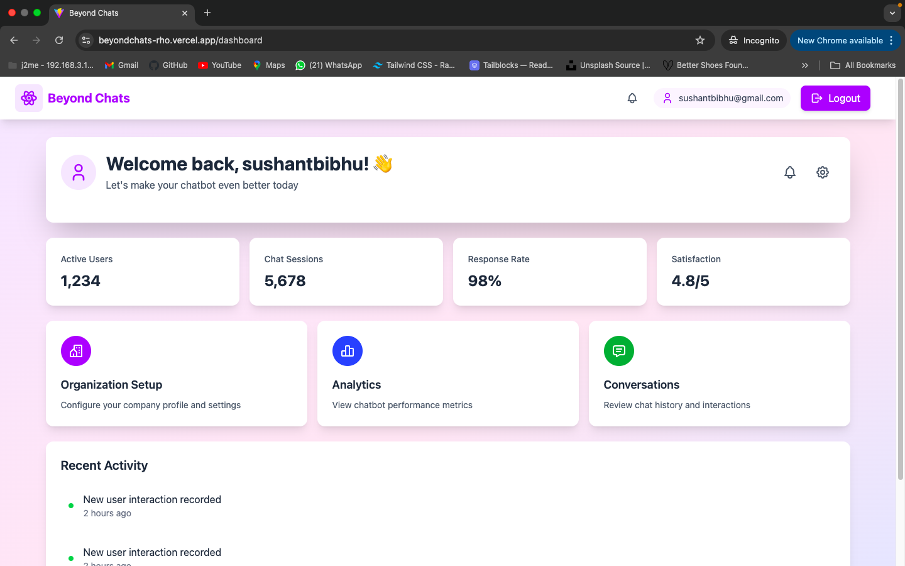

# BeyondChats 

## 🚀 Project Overview
BeyondChats is a chatbot company that helps businesses integrate AI-powered chatbots seamlessly. This project is a UI/UX implementation of the chatbot setup workflow.

## 🎯 Features
### 1️⃣ User Registration
### 2️⃣ Setup Organization
### 3️⃣ Chatbot Integration & Testing

## 🛠️ Tech Stack
- **Frontend**: React (Vite), Tailwind CSS
- **Authentication**: Firebase (JavaScript)

## 📦 Installation
```bash
# Clone the repository
git clone <https://github.com/thisissushant/beyondchats>
cd beyondchats

# Install dependencies
 npm install

# Start development server
npm run dev
```

## 🔗 Live Demo
[Live Project](https://beyondchats-rho.vercel.app/)


## 📧 Contact
For any queries, feel free to reach out:
- **Email**: sushantbibhu@gmail.com
- **GitHub**: [GitHub](https://github.com/thisissushant/beyondchats)


## 📸 Screenshots

### Sign In Page


### Sign Up Page


### Setup Organisation


### Chatbot Integration


### Dashboard


